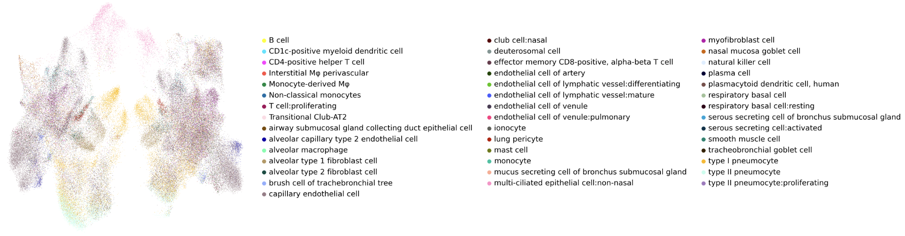
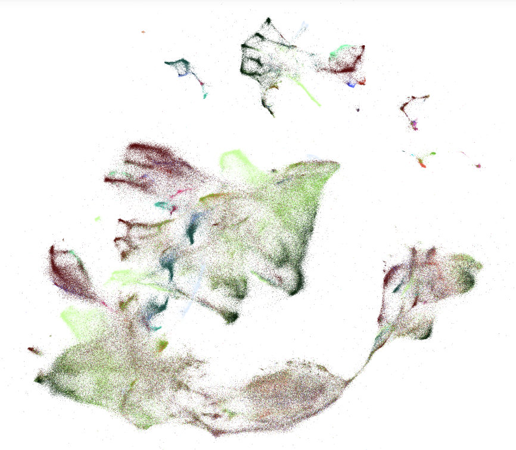

# hra-cell-embeddings
A repo to capture cell embedding visualizations

## Handbook Explanation
In the handbook folder, a [Visualization Handbook](https://github.com/cns-iu/hra-cell-embeddings/blob/main/handbook/453k%20Cell%20Visualization.pdf) is used to justify our visualization settings and showcase how our design evolved. 

## Code Explanation
### Visualization
1. [Basic Visualization - Mapping the cell type labels with the h5ad source file](https://github.com/cns-iu/hra-cell-embeddings/blob/main/juypter%20notebook/1.%20%5BBasic%20UMAP%20Visualizaiton%5D%20Mapping%20the%20cell%20type%20labels%20with%20h5ad%20source%20file.ipynb): here, we adopt two kinds of normalization strategies to normalize the matrix in [h5ad source file](https://portal.hubmapconsortium.org/browse/dataset/176edb4b0e16059522f6f087576fbeec) to improve the readability of the visualization. As shown below:
   
   
2. [Visualization Tuning - PCA-200 + tSNE](https://github.com/cns-iu/hra-cell-embeddings/blob/main/juypter%20notebook/2.%20%5BVisualization%20Tuning%5D%20%5BPCA-200%20%2B%20tSNE%5D%20%5B10%20Datasets%20Concat%5D%20%5Bspliced_unspliced_sum%5D%20Visuailzation.ipynb) / [Visualization Tuning - PCA-1000 + tSNE](https://github.com/cns-iu/hra-cell-embeddings/blob/main/juypter%20notebook/2.%20%5BVisualization%20Tuning%5D%20%5BPCA-1000%20%2B%20tSNE%5D%20%5B10%20Datasets%20Concat%5D%20%5Bspliced_unspliced_sum%5D%20Visuailzation.ipynb): we adopt the PCA algorithm for 200/1000 dimensions and then for t-SNE algorithm, with the same normalization settings in the Basic Visualization jupyter notebook. The visualization for the PCA setting of 1000 is shown below:
   
3. [Visualization Tuning the top 24 cell types - PCA-200 + tSNE](https://github.com/cns-iu/hra-cell-embeddings/blob/main/juypter%20notebook/2.%20%5BVisualization%20Tuning%5D%20%5BVisualise%20limited%20labels%5D%20%5BPCA-1000%20%2B%20tSNE%5D%20%5B10%20Datasets%20Concat%5D%20%5Bspliced_unspliced_sum%5D%20Visuailzation.ipynb): we visualize the top 24 cell types as shown below:
   
